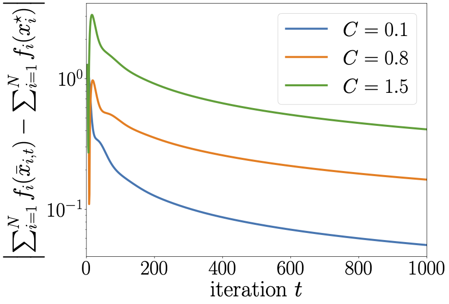
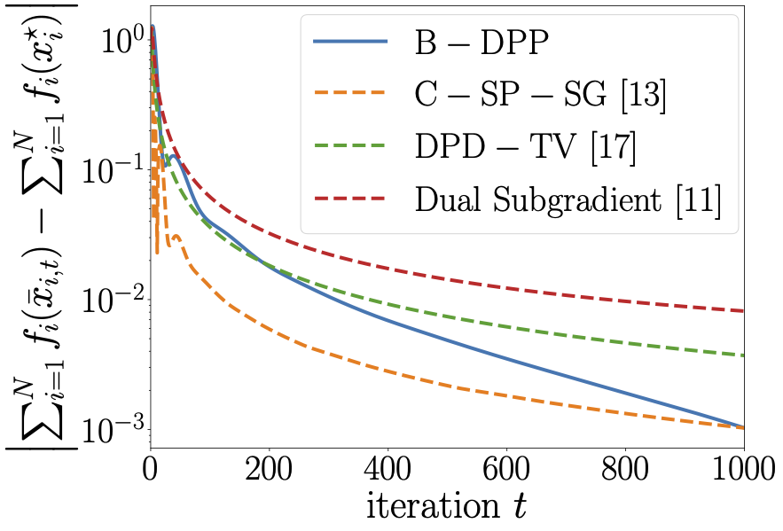

# A Distributed Buffering Drift-Plus-Penalty Algorithm for Coupling Constrained Optimization

This repository contains the numerical experiments in the paper [*A Distributed Buffering Drift-Plus-Penalty Algorithm for Coupling Constrained Optimization*](https://arxiv.org/abs/2310.09547) (L-CSS, revise and resubmit, 2023).
The experiments involve a [virtualized 5G resource allocation problem](https://ieeexplore.ieee.org/abstract/document/8635559) which aims to determine the optimal amount of resources allocated to each slice such that the sum of cost functions of slice thicknesses is minimized subject to the resource constraints.
We investigate the convergence performance of the proposed algorithm, called B-DPP, and the effect of the buffer parameter $\gamma_t=C/\sqrt{t}$ on the objective error and constraint violations.
In addition, we compare B-DPP with the [distributed dual subgradient method](https://www.sciencedirect.com/science/article/abs/pii/S0005109817303291), [C-SP-SG](https://ieeexplore.ieee.org/abstract/document/7588109), and [DPD-TV](https://www.sciencedirect.com/science/article/abs/pii/S0005109821002594) to demonstrate its competitive performance.

## Description

### Dependencies

The code is written in Python 3.7.7 and requires the following packages:

- [numpy](https://numpy.org/)
- [networkx](https://networkx.org/)
- [cvxpy](https://www.cvxpy.org/)
- [matplotlib](https://matplotlib.org/)

Moreover, a [Tex distribution](https://www.latex-project.org/get/#tex-distributions) is required to render the figures.

### Code structure

- `graph_gen.py`: generate the network topology.
- `data_gen.py`: generate the data for the virtualized 5G resource allocation problem.
- `algorithms.py`: implement B-DPP, C-SP-SG, DPD-TV, and the distributed dual subgradient method.
- `main.py`: run the experiments.
- `plot.py`: plot the results.

## Results

### Effect of the buffer parameter

<table>
    <tr>
        <td></td>
        <td></td>
    </tr>
</table>

### Comparison

<table>
    <tr>
        <td></td>
        <td></td>
    </tr>
</table>
